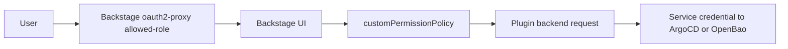

# Add Plugin-Scoped Backstage Users

This guide shows how to add users that can use a Backstage plugin, without giving direct access to ArgoCD/OpenBao UIs.

## Target Example

1. `argocd-dev`
- Can log in to Backstage
- Can use ArgoCD plugin in Backstage
- Cannot log in to ArgoCD UI directly
- Cannot use OpenBao plugin/UI

2. `openbao-dev`
- Can log in to Backstage
- Can use Vault/OpenBao plugin in Backstage
- Cannot log in to OpenBao UI directly
- Cannot use ArgoCD plugin/UI

## Control Points

1. Keycloak roles/users: `gitops/argocd/bootstrap/apps/identity-management/keycloak-resources/realm-import.yaml`
2. Backstage ingress allow-list: `gitops/argocd/main/apps/infrastructure/oauth2-proxy/helm-releases.yaml`
3. Frontend role checks:
- `tools/backstage-app/packages/app/src/hooks/useRoleAccess.ts`
- `tools/backstage-app/packages/app/src/components/Root/Root.tsx`
- `tools/backstage-app/packages/app/src/components/catalog/EntityPage.tsx`
4. Backend permission enforcement:
- `tools/backstage-app/packages/backend/src/modules/customPermissionPolicy.ts`
5. Direct ArgoCD RBAC (must stay unmapped for `*-dev`): `terraform/bootstrap/argocd.tf`
6. Direct OpenBao access gate (must stay admin-only):
- `gitops/argocd/main/apps/infrastructure/oauth2-proxy/helm-releases.yaml`
- `common/tools/ansible/roles/openbao/tasks/post_argo.yml`

## Request Path



The user role gates Backstage access and plugin authorization. Plugin API calls use service credentials, not per-user tokens.

## 1. Add Roles and Users in Keycloak

Add roles/groups/users in `realm-import.yaml`:

```yaml
spec:
  realm:
    roles:
      realm:
        - name: argocd-dev
          description: Backstage ArgoCD plugin-only users
        - name: openbao-dev
          description: Backstage OpenBao plugin-only users
    groups:
      - name: argocd-dev
      - name: openbao-dev
    users:
      - username: argocd-dev
        enabled: true
        realmRoles: [argocd-dev]
        groups: [argocd-dev]
      - username: openbao-dev
        enabled: true
        realmRoles: [openbao-dev]
        groups: [openbao-dev]
```

## 2. Allow These Roles Into Backstage

In `backstage-oauth2-proxy` `allowed-role`, add both roles:

```yaml
allowed-role: "agencies-admin,argocd-admin,openbao-admin,argocd-dev,openbao-dev"
```

If omitted, users cannot access Backstage at all.

## 3. Keep Direct ArgoCD/OpenBao Blocked

1. ArgoCD:
- Do not add `argocd-dev` to `terraform/bootstrap/argocd.tf` `policy.csv`.
- With `policy.default = role:none`, direct ArgoCD access stays denied.

2. OpenBao:
- Keep `openbao-oauth2-proxy` `allowed-role: openbao-admin`.
- Keep OpenBao OIDC role `bound_claims.roles: [openbao-admin]` in `post_argo.yml`.

## 4. Extend Backstage Frontend Role Checks

Current hook exports `isArgocdAdmin` / `isOpenbaoAdmin`. For plugin-scoped roles, add explicit checks such as:

```ts
const canUseArgocdPlugin =
  hasRole('argocd-admin') || hasRole('argocd-admins') || hasRole('argocd-dev');

const canUseOpenbaoPlugin =
  hasRole('openbao-admin') || hasRole('openbao-admins') || hasRole('openbao-dev');
```

Then use these checks in:

1. Sidebar items (`Root.tsx`)
2. Entity plugin cards/routes (`EntityPage.tsx`)

## 5. Extend Backend Permission Policy

In `customPermissionPolicy.ts`, include dev roles in plugin permission checks and catalog scopes.

Example pattern:

```ts
const canUseArgocdPlugin = hasAnyRole(user, [
  'argocd-admin',
  'argocd-admins',
  'argocd-dev',
]);

const canUseOpenbaoPlugin = hasAnyRole(user, [
  'openbao-admin',
  'openbao-admins',
  'openbao-dev',
]);
```

Use these for:

1. `argocd.*` permissions
2. `vault.*` permissions
3. Catalog entity scope selection for plugin entities

Without backend policy updates, UI visibility alone is not enough.

## 6. Apply and Verify

```bash
make apply
```

Verification:

1. `argocd-dev`
- Backstage login works
- ArgoCD plugin works in Backstage
- Direct ArgoCD login denied
- OpenBao plugin hidden/denied

2. `openbao-dev`
- Backstage login works
- OpenBao plugin works in Backstage
- Direct OpenBao login denied
- ArgoCD plugin hidden/denied
