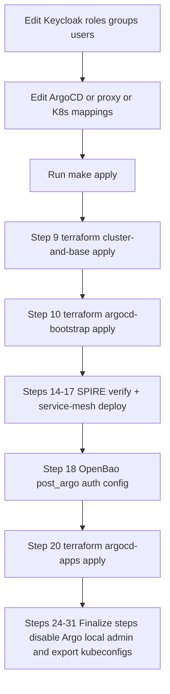

# Add Users and Map Permissions

This guide describes the current user/role workflow in the Ansible-first setup.

## Source of Truth

1. Identities, roles, groups, and OIDC clients: `gitops/argocd/bootstrap/apps/identity-management/keycloak-resources/realm-import.yaml`
2. ArgoCD authorization mapping: `terraform/bootstrap/argocd.tf` (`configs.rbac.policy.csv`)
3. Backstage/OpenBao ingress role gates: `gitops/argocd/main/apps/infrastructure/oauth2-proxy/helm-releases.yaml`
4. Kubernetes API role binding: `gitops/argocd/bootstrap/apps/base/kube-admin-rbac.yaml`

## Apply Flow (Matches `common/tools/ansible/site.yml`)



## 1. Add Roles, Groups, Users in Keycloak

Edit `realm-import.yaml` under:

1. `spec.realm.roles.realm`
2. `spec.realm.groups`
3. `spec.realm.users`

Example roles:

```yaml
spec:
  realm:
    roles:
      realm:
        - name: argocd-viewer
          description: Read-only ArgoCD users
    groups:
      - name: argocd-viewer
    users:
      - username: argocd-viewer
        enabled: true
        realmRoles:
          - argocd-viewer
        groups:
          - argocd-viewer
        requiredActions:
          - UPDATE_PASSWORD
        credentials:
          - type: password
            value: ChangeMe123!
            temporary: true
      - username: openbao-argocd-admin
        enabled: true
        realmRoles:
          - argocd-admin
          - openbao-admin
        groups:
          - argocd-admin
          - openbao-admin
        requiredActions:
          - UPDATE_PASSWORD
        credentials:
          - type: password
            value: ChangeMe123!
            temporary: true
```

## 2. Map Realm Roles to ArgoCD RBAC

Edit `terraform/bootstrap/argocd.tf` in `configs.rbac.policy.csv`.

Example mapping for read-only ArgoCD users:

```csv
g, argocd-viewer, role:readonly
g, /argocd-viewer, role:readonly
```

Notes:

1. Current default is `policy.default = role:none`.
2. Unmapped users are denied in ArgoCD.
3. `argocd-admin` is already mapped to `role:admin`.

## 3. Control Backstage/OpenBao Entry via oauth2-proxy

Edit `gitops/argocd/main/apps/infrastructure/oauth2-proxy/helm-releases.yaml`.

1. Backstage access is controlled by `backstage-oauth2-proxy` `allowed-role`.
2. OpenBao UI access is controlled by `openbao-oauth2-proxy` `allowed-role`.

Example: if `argocd-viewer` should use Backstage, add it to Backstage `allowed-role`.

## 4. Kubernetes API Access (Optional)

Only users mapped to `oidc:kube-admin` get cluster-admin by default.

File:

- `gitops/argocd/bootstrap/apps/base/kube-admin-rbac.yaml`

If you add more Kubernetes access roles, create explicit RBAC resources and keep OIDC group subjects in `oidc:<role>` format.

## 5. Apply and Verify

```bash
make apply
```

Quick checks:

```bash
kubectl -n argocd get configmap argocd-rbac-cm -o yaml
kubectl -n oauth2-proxy get deploy backstage-oauth2-proxy openbao-oauth2-proxy
kubectl --kubeconfig kubeconfig/humans/keycloak.kubeconfig auth can-i get pods -A
```

## Optional One-Off User Script

For temporary local user creation outside GitOps manifests:

```bash
./scripts/ensure-oidc-user.sh
```

Use this only for short-lived/testing users. Git-managed `realm-import.yaml` remains the durable source of truth.
