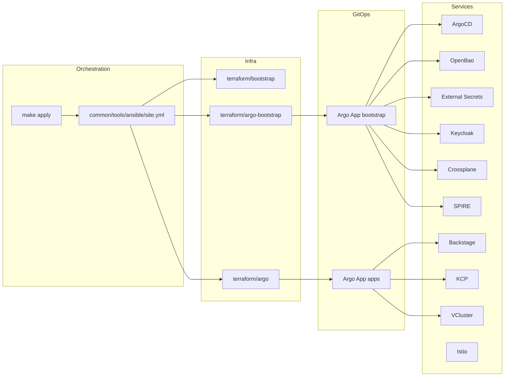
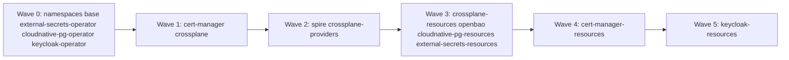
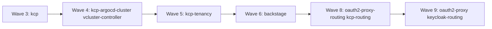
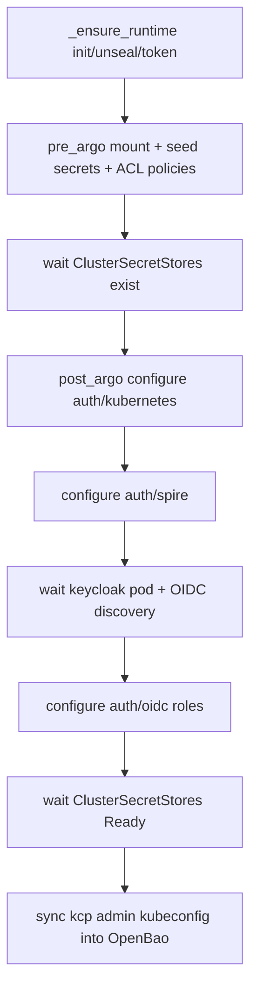
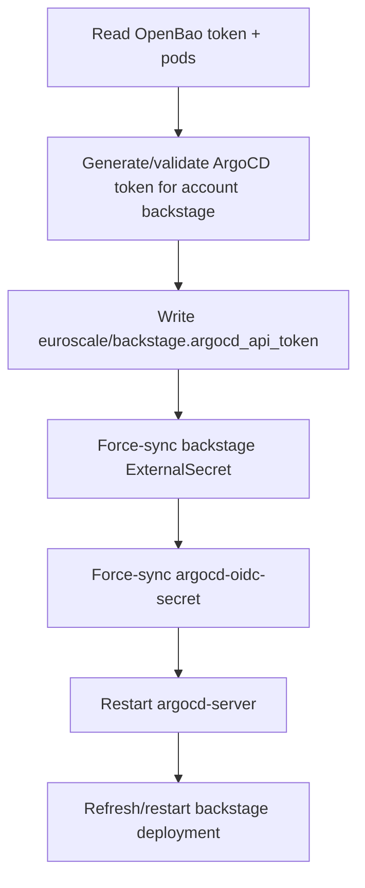

# Architecture

## Deployment Orchestrator

The authoritative deployment flow is Ansible:

- Entry: `make apply`
- Executor: `common/tools/ansible/site.yml`
- Host: local (`inventory/hosts.ini`)
- Cluster type: `kind` (default) or `remote` (set `CLUSTER_TYPE=remote`)

OpenTofu is still used for infrastructure bootstrap roots, but is provider-agnostic — Kind-specific operations (cluster creation, registry, hostname injection) are handled in Ansible roles gated on `cluster_type == "kind"`.

## Ansible Step Graph (Exact Order)

```mermaid
flowchart TD
  A1[1 preflight_dns sync service-dns.env] --> A2[2 certs keycloak-oidc root CA]
  A2 --> A3[3 cluster ensure_registry]
  A3 --> A4[4 terraform init]
  A4 --> A5[5 cluster create_kind<br/><i>gated: cluster_type==kind</i>]
  A5 --> A6[6 cluster ensure_registry]
  A6 --> A7[7 istio mirror skipped]
  A7 --> A8[8 backstage build_and_push]
  A8 --> A9[9 terraform bootstrap apply admin enabled]
  A9 --> A10[10 terraform argo_bootstrap apply]
  A10 --> A11[11 openbao pre_argo]
  A11 --> A12[12 wait external secret stores exist]
  A12 --> A13[13 wait CNPG databases<br/>keycloak-db / kcp-db]
  A13 --> A14[14 verify SPIRE health]
  A14 --> A15[15 deploy Istio Applications]
  A15 --> A16[16 wait Istio sync]
  A16 --> A17[17 wait Istio-gateway sync]
  A17 --> A18[18 openbao post_argo]
  A18 --> A19[19 openbao_spire configure auth/spire]
  A19 --> A20[20 terraform argo apply]
  A20 --> A21[21 wait external secret stores ready]
  A21 --> A22[22 openbao sync kcp kubeconfig]
  A22 --> A23[23 kubecfg export kcp kubeconfig]
  A23 --> F1[24 Finalize argocd set_backstage_token]
  F1 --> F2[25 Finalize backstage refresh]
  F2 --> F3[26 Finalize terraform disable argocd admin]
  F3 --> F4[27 Finalize keycloak enforce password reset]
  F4 --> F5[28 Finalize kubecfg export]
  F5 --> F6[29 Finalize kcp ensure_agencies_workspace]
```

## Control-Plane Layers

## Argo Application Waves

### Bootstrap (`gitops/argocd/bootstrap`)

### Main (`gitops/argocd/main`)

## OpenBao Runtime and Bootstrap Dependencies

## Backstage and ArgoCD Token Finalization

## Security/Hardening End State

1. ArgoCD authenticates directly with Keycloak OIDC client `argocd`.
2. Backstage and OpenBao ingress are protected by oauth2-proxy.
3. Backstage reads OpenBao via SPIRE workload identity (auth/spire) instead of Kubernetes SA JWT.
4. Workload-to-workload mTLS uses SPIRE-issued identities via Istio SPIRE certificate provider.
5. ArgoCD local admin login is disabled in final Terraform phase.
6. Keycloak `admin` user is forced to change password (`UPDATE_PASSWORD`).
