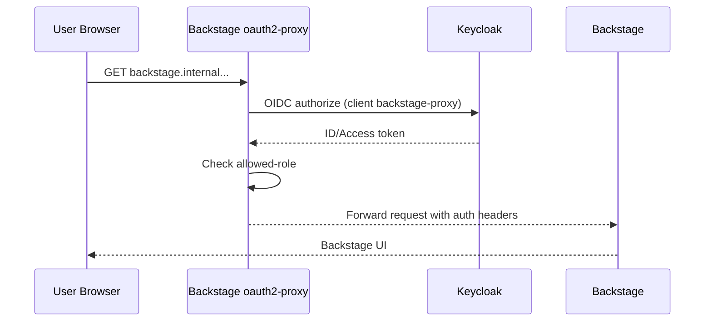
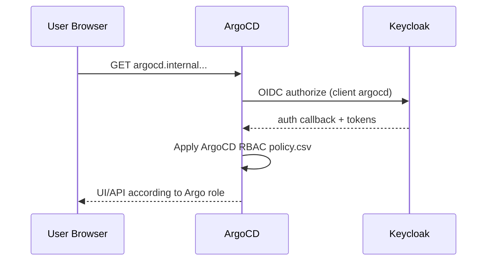
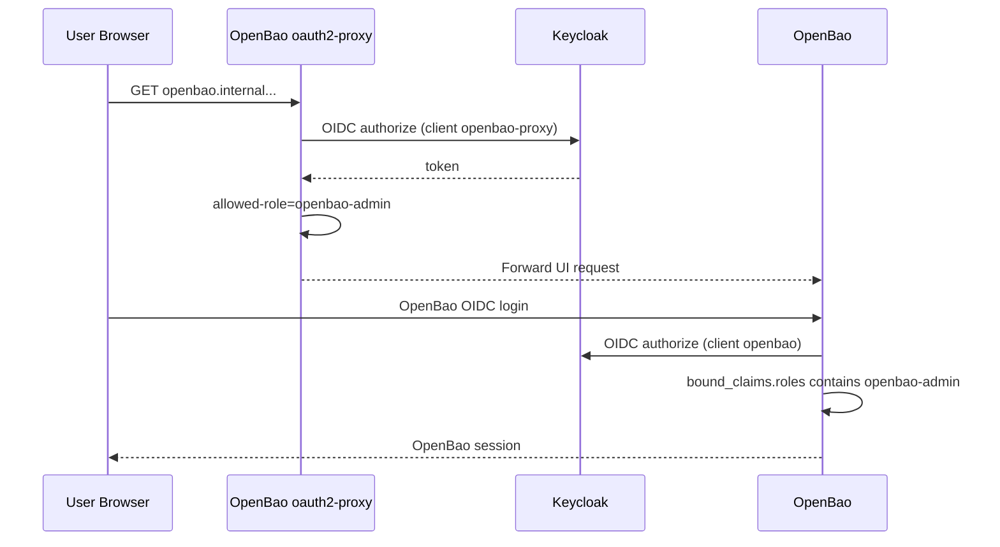

# AuthN/AuthZ: Keycloak, Backstage, ArgoCD, OpenBao

This document reflects the current Ansible + GitOps setup.

## Components and Responsibility

1. Keycloak
- Identity provider for realm `euroscale`.
- Defines realm roles: `argocd-admin`, `openbao-admin`, `agencies-admin`, `kube-admin`, `kcp-user`.
- Manages clients for ArgoCD, Kubernetes, oauth2-proxy (Backstage/OpenBao), and OpenBao OIDC.
- Source: `gitops/argocd/bootstrap/apps/identity-management/keycloak-resources/realm-import.yaml`.

2. oauth2-proxy (Ingress Gate)
- Protects `openbao.internal.euroscale.local` and `backstage.internal.euroscale.local`.
- Enforces allowed roles before traffic reaches backend service.
- Allowed-role sets are generated from centralized authz model/Rego inputs (`../agencies/authz/model.json`, `../agencies/authz/rego/*`) into `helm-releases.yaml`.
- Source: `gitops/argocd/main/apps/infrastructure/oauth2-proxy/helm-releases.yaml`.

3. ArgoCD
- Authenticates directly against Keycloak client `argocd`.
- Authorizes by ArgoCD RBAC (`policy.csv`) with default deny.
- RBAC lines are generated from centralized authz model/Rego inputs.
- Sources: `terraform/bootstrap/argocd.tf`, `terraform/bootstrap/generated/argocd-policy.csv`.

4. OpenBao
- Ingress access additionally gated by oauth2-proxy (`allowed-role: openbao-admin`).
- OpenBao native OIDC auth configured in Ansible `openbao post_argo` step.
- OIDC role bindings are generated from centralized authz model/Rego inputs.
- Kubernetes auth roles used for ESO and Backstage runtime service auth.

5. Backstage
- Login identity forwarded by oauth2-proxy provider.
- Fine-grained authorization enforced in custom backend permission policy.
- Role sets/plugin gates are generated from centralized authz model/Rego inputs.
- ArgoCD plugin uses service token from OpenBao/ExternalSecret.
- OpenBao plugin uses short-lived runtime token via Kubernetes auth.

## Current Authentication Flows

### A) Backstage User Login



### B) ArgoCD User Login



### C) OpenBao UI Login



## Service-to-Service Credential Flows

### Backstage -> ArgoCD plugin

1. Ansible role `argocd` generates/validates token for ArgoCD account `backstage`.
2. Token stored in OpenBao path `euroscale/backstage.argocd_api_token`.
3. ExternalSecret syncs token into `backstage/backstage-secrets`.
4. Backstage proxy sends `Authorization: Bearer ${ARGOCD_API_TOKEN}` to ArgoCD API.

### Backstage -> OpenBao plugin

1. Backstage `openbaoProxy.ts` uses a `CredentialProvider` abstraction with two modes:
   - **spire** (preferred): Reads JWT SVID from `/var/run/secrets/spiffe/jwt-svid.token`, calls `auth/spire/login` with role `backstage`.
   - **kubernetes** (fallback): Reads SA token from `/var/run/secrets/kubernetes.io/serviceaccount/token`, calls `auth/kubernetes/login` with role `backstage`.
2. Receives short-lived OpenBao token (TTL 15m, runtime refresh).
3. Reads from `euroscale` mount according to policy `backstage-openbao`.

```mermaid
flowchart LR
  CP[openbaoProxy.ts CredentialProvider] --> D{SPIRE JWT SVID file exists?}
  D -- Yes --> S[Read JWT SVID]
  D -- No --> K[Read SA token]
  S --> LS[OpenBao auth/spire/login role backstage]
  K --> LK[OpenBao auth/kubernetes/login role backstage]
  LS --> T[Short-lived OpenBao token]
  LK --> T
  T --> P[/api/proxy/openbao]
  P --> M[euroscale mount metadata/data]
```

## Authorization Layers (All Must Permit)

1. Ingress oauth2-proxy allow-role check.
2. App-native authorization (ArgoCD RBAC / OpenBao policies).
3. Backstage backend permission policy (`customPermissionPolicy.ts`).
4. Backstage frontend role-based visibility (`useRoleAccess`, `Root`, `EntityPage`).

## Current Role Matrix

1. `argocd-admin`
- Backstage access via oauth2-proxy allowed-role list.
- ArgoCD plugin access in Backstage.
- Direct ArgoCD access (mapped to `role:admin`).
- No OpenBao plugin access.

2. `openbao-admin`
- Backstage access via oauth2-proxy allowed-role list.
- OpenBao plugin access in Backstage.
- Direct OpenBao access via openbao-oauth2-proxy.
- No ArgoCD plugin access.

3. `agencies-admin`
- Backstage access via oauth2-proxy allowed-role list.
- Scaffolder + Crossplane actions per policy.
- No direct ArgoCD/OpenBao admin mapping by default.

4. `kube-admin`
- Intended only for Kubernetes API OIDC kubeconfig (`kubeconfig/humans/kube-admin.kubeconfig`).
- Not included in Backstage plugin role sets.
- Not mapped in ArgoCD RBAC policy CSV.
- Not bound in OpenBao OIDC roles.

5. `kcp-user`
- Intended only for KCP OIDC kubeconfig (`kubeconfig/kcp/kcp-user.kubeconfig`).
- Not included in Backstage plugin role sets.
- Not mapped in ArgoCD RBAC policy CSV.
- Not bound in OpenBao OIDC roles.

## Key Files

1. Keycloak roles/clients/users:
- `gitops/argocd/bootstrap/apps/identity-management/keycloak-resources/realm-import.yaml`

2. oauth2-proxy gates:
- `gitops/argocd/main/apps/infrastructure/oauth2-proxy/helm-releases.yaml`

3. ArgoCD OIDC + RBAC:
- `terraform/bootstrap/argocd.tf`

4. OpenBao auth config (Kubernetes + OIDC):
- `common/tools/ansible/roles/openbao/tasks/post_argo.yml`

5. Backstage permission policy:
- `tools/backstage-app/packages/backend/src/modules/customPermissionPolicy.ts`

6. Backstage runtime OpenBao auth proxy:
- `tools/backstage-app/packages/backend/src/modules/openbaoProxy.ts`

7. Centralized authorization source and Rego checks:
- `../agencies/authz/model.json`
- `../agencies/authz/rego/compile.rego`
- `../agencies/authz/rego/validate.rego`
- `../common/scripts/generate-authz-config.mjs`
