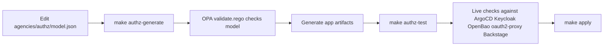

# Centralized AuthZ With OPA/Rego

This document explains how authorization is centralized in this repository and how to add, modify, or delete permissions safely.

## Short Answer

`../agencies/authz/model.json` is the current source of truth for permission intent.

OPA/Rego (`../agencies/authz/rego/*.rego`) is the policy contract and validation layer that:

1. Validates the model (`validate.rego`).
2. Provides a compile interface (`compile.rego`) used by the generator.

In other words:

1. You author intent in `../agencies/authz/model.json`.
2. Rego enforces that the intent is coherent and follows guardrails.
3. `../common/scripts/generate-authz-config.mjs` fans out generated config to ArgoCD, Keycloak, Backstage, OpenBao/oAuth2 Proxy, and Ansible vars.

## End-to-End Flow



## Files That Matter

Authoring:

1. `../agencies/authz/model.json`
2. `../agencies/authz/rego/validate.rego`
3. `../agencies/authz/rego/compile.rego`
4. `../common/scripts/generate-authz-config.mjs`

Generated outputs:

1. `terraform/bootstrap/generated/argocd-policy.csv`
2. `gitops/argocd/bootstrap/apps/identity-management/keycloak-resources/realm-import.yaml` (marked generated blocks)
3. `gitops/argocd/main/apps/infrastructure/oauth2-proxy/helm-releases.yaml` (marked generated blocks)
4. `tools/backstage-app/packages/backend/src/generated/authzConfig.ts`
5. `tools/backstage-app/packages/app/src/generated/authzConfig.ts`
6. `tools/backstage-app/catalog-info.yaml` and `tools/backstage-app/catalog-entities.yaml` (marked generated blocks)
7. `common/tools/ansible/group_vars/authz.generated.yml`

Verification:

1. `common/tools/ansible/roles/authz_tests/tasks/main.yml`
2. `common/tools/ansible/authz-tests.yml`
3. `Makefile` targets `authz-generate`, `authz-opa-check`, `authz-test`

## What Gets Controlled Centrally

From one model, the following are generated and verified:

1. ArgoCD RBAC policy lines.
2. Keycloak realm roles, groups, and users.
3. oauth2-proxy allowed roles for Backstage and OpenBao ingress.
4. Backstage role sets, plugin role gating, catalog scope mappings, and generated catalog components.
5. OpenBao OIDC role bindings (via Ansible generated vars).
6. Kubeconfig identity constraints (`kube-admin` for kind kubeconfig, `kcp-user` for KCP kubeconfig).

## Standard Change Workflow

1. Edit `../agencies/authz/model.json`.
2. Regenerate artifacts:

```bash
make authz-generate
```

3. Validate model with strict OPA:

```bash
make authz-opa-check
```

4. Run fast live authz checks:

```bash
make authz-test
```

5. Apply full deployment if needed:

```bash
make apply
```

## How To Modify Permissions

Typical edits in `../agencies/authz/model.json`:

1. ArgoCD access:
   - Edit `argocd.policyCsvLines`.
2. Keycloak identity:
   - Edit `keycloak.realmRoles`, `keycloak.groups`, `keycloak.users`.
3. Backstage access behavior:
   - Edit `backstage.roleSets`, `backstage.argocdPluginRoles`, `backstage.catalogScopes`, `backstage.menu`, `backstage.argocdCatalogComponents`.
4. OpenBao OIDC role mapping:
   - Edit `openbao.oidcRoleBindings`.
5. Ingress role gates:
   - Edit `oauth2Proxy.backstageAllowedRoles` and `oauth2Proxy.openbaoAllowedRoles`.
6. Kubeconfig identity constraints:
   - Edit `kubeconfigs.*`.

After edits, always run `make authz-generate` and `make authz-test`.

## How To Add A New Permission Set (Example Pattern)

Example: add a new role `example-admin`.

1. Add role metadata in `keycloak.realmRoles`.
2. Add group in `keycloak.groups`.
3. Add user or group membership in `keycloak.users` as needed.
4. Add ArgoCD policy lines in `argocd.policyCsvLines` if Argo access is needed.
5. Add Backstage role set/plugin scope/menu entries in `backstage.*` if UI access is needed.
6. Add oauth2-proxy allowed role entries if web ingress for app UIs is required.
7. Add OpenBao OIDC binding only if direct OpenBao OIDC access is required.
8. Run generation and tests.

## How To Delete Permissions Safely

1. Remove role references from all sections in `../agencies/authz/model.json`:
   - Keycloak roles/groups/users.
   - Argo policy lines.
   - Backstage role sets/plugin roles/menu/catalog scopes.
   - oauth2-proxy allowed roles.
   - OpenBao OIDC bindings.
2. Regenerate artifacts.
3. Run `make authz-test` to catch stale references.
4. Apply and verify login/access behavior.

## Guardrails Enforced By Rego

`../agencies/authz/rego/validate.rego` currently enforces, among others:

1. Required base roles exist.
2. Forbidden principals (for example `kube-admin`, `kcp-user`) are blocked from Argo/Backstage/OpenBao permission mappings.
3. Required Backstage role sets and argocd plugin role coverage.
4. Required oauth2-proxy role gates.
5. `kcp-user` isolation and kubeconfig user constraints.

If a change violates these rules, `make authz-opa-check` and strict authz tests fail.

## Important Notes

1. Do not hand-edit generated blocks in generated target files.
2. Always modify `../agencies/authz/model.json` first.
3. Treat `make authz-test` as required before `make apply`.
4. If you need a new policy invariant, add it in `../agencies/authz/rego/validate.rego` and then update `../agencies/authz/model.json` accordingly.
