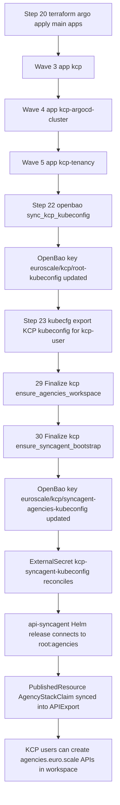
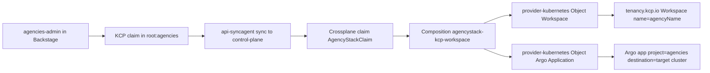

# KCP Integration (Current State)

This document reflects the current KCP flow in this repository.

## What Is Deployed

1. KCP runtime app: `gitops/argocd/main/apps/infrastructure/kcp/`
2. Argo destination registration for KCP root: `gitops/argocd/main/apps/infrastructure/kcp-argocd-cluster/`
3. KCP tenancy API CRDs (on KCP root destination): `gitops/argocd/main/apps/infrastructure/kcp-tenancy/`
4. KCP api-syncagent (runs in control-plane cluster): `gitops/argocd/main/apps/infrastructure/kcp/syncagent-release.yaml`
5. Agency XRD + Composition layer: `../agencies/gitops/argocd/bootstrap/apps/base/crossplane/resources/`
6. KCP serving TLS certificate via cert-manager: `gitops/argocd/main/apps/infrastructure/kcp/certificate.yaml`

## Ansible + Argo Sequence



Notes:

1. `cluster-kcp-root` reads key `kcp/root-kubeconfig` from `vault-backend` (mount path `euroscale`).
2. `kcp-syncagent-kubeconfig` reads key `kcp/syncagent-agencies-kubeconfig` from `vault-backend`.
3. Before the finalize tasks write fresh kubeconfig data, temporary ExternalSecret errors can occur.

## Key Files and Responsibilities

1. Main app wave wiring:
- `gitops/argocd/main/kcp.yaml` (wave 3)
- `gitops/argocd/main/kcp-argocd-cluster.yaml` (wave 4)
- `gitops/argocd/main/kcp-tenancy.yaml` (wave 5)

2. KCP runtime:
- `gitops/argocd/main/apps/infrastructure/kcp/deployment.yaml`
- `gitops/argocd/main/apps/infrastructure/kcp/service.yaml`
- `gitops/argocd/main/apps/infrastructure/kcp/kcp-oidc-ca-external-secret.yaml`

3. Argo cluster secret from OpenBao:
- `gitops/argocd/main/apps/infrastructure/kcp-argocd-cluster/kcp-root-cluster-secret.yaml`

4. Tenancy CRDs applied to destination `kcp-root`:
- `gitops/argocd/main/apps/infrastructure/kcp-tenancy/tenancy-crds.yaml`
- `gitops/argocd/main/apps/infrastructure/kcp-tenancy/kcp-root-rbac.yaml`

5. OpenBao sync task (writes kubeconfig payload):
- `common/tools/ansible/roles/openbao/tasks/sync_kcp_kubeconfig.yml`

6. KCP kubeconfig export task:
- `common/tools/ansible/roles/kubecfg/tasks/main.yml` (`kubecfg_action: export_kcp_roles`)

7. Agencies workspace + api-syncagent bootstrap task:
- `common/tools/ansible/roles/kcp/tasks/main.yml` (`kcp_action: ensure_agencies_workspace`)
- `common/tools/ansible/roles/kcp/tasks/main.yml` (`kcp_action: ensure_syncagent_bootstrap`)

8. api-syncagent runtime + service-cluster permissions:
- `gitops/argocd/main/apps/infrastructure/kcp/syncagent-kubeconfig-external-secret.yaml`
- `gitops/argocd/main/apps/infrastructure/kcp/syncagent-release.yaml`
- `gitops/argocd/main/apps/infrastructure/kcp/syncagent-rbac-agencies.yaml`

9. External KCP routing (Istio):
- `gitops/argocd/main/kcp-routing.yaml`
- `gitops/argocd/main/apps/infrastructure/kcp-routing/virtual-service.yaml`
- `gitops/argocd/bootstrap/apps/infrastructure/istio-gateway/gateway.yaml`

## Sync Model

With kcp v0.30, multi-cluster workload sync from older TMC flows is not part of core kcp. In this repo, synchronization is implemented with `api-syncagent`, which:

1. Publishes `AgencyStackClaim` from the service cluster into kcp as part of `APIExport agencies.euro.scale`.
2. Watches objects created in bound kcp workspaces.
3. Syncs these objects down to the control-plane cluster so Crossplane can reconcile them.

## External Access (kcp.internal.euroscale.local)

KCP is exposed through Istio using TLS passthrough:

1. Gateway host `kcp.internal.euroscale.local` is configured on `euroscale-internal-gateway`.
2. Gateway server uses `protocol: TLS` with `tls.mode: PASSTHROUGH`.
3. `VirtualService` `kcp-internal` routes SNI host `kcp.internal.euroscale.local` on port `443` to `kcp.kcp.svc.cluster.local:6443`.
4. The `kcp-user` kubeconfig is exported with server URL `https://kcp.internal.euroscale.local`.

KCP server TLS is cert-manager-managed:

1. `Certificate` `kcp-server-tls` is issued in namespace `kcp` by `ClusterIssuer/euroscale-local-ca`.
2. KCP serves that certificate via `--tls-cert-file=/etc/kcp/tls/tls.crt` and `--tls-private-key-file=/etc/kcp/tls/tls.key`.

KCP API authentication is Keycloak OIDC-based:

1. `ExternalSecret` `kcp-keycloak-oidc-ca` pulls `keycloak/oidc-ca.ca_crt` from OpenBao into namespace `kcp`.
2. KCP starts with:
- `--oidc-issuer-url=https://keycloak.internal.euroscale.local/realms/euroscale`
- `--oidc-client-id=kubernetes`
- `--oidc-ca-file=/etc/kcp/oidc/ca.crt`
- `--oidc-username-claim=preferred_username`
- `--oidc-username-prefix=-`
- `--oidc-groups-claim=roles`
- `--oidc-groups-prefix=oidc:`
3. `kcp-tenancy` syncs `ClusterRoleBinding/kcp-root-kcp-user-admin` so group `oidc:kcp-user` is authorized on root.

DNS/config source:

1. `gitops/config/service-dns.env` defines `KCP_HOST` and `KCP_URL`.
2. Ansible preflight sync copies this into:
- `gitops/argocd/bootstrap/apps/infrastructure/istio-gateway/service-dns.env`
- `gitops/argocd/main/apps/infrastructure/kcp-routing/service-dns.env`

## Using KCP In Euroscale

1. Run `make apply` (or `ansible-playbook common/tools/ansible/site.yml`).
2. Use the generated KCP kubeconfig:
- `kubeconfig/kcp/kcp-user.kubeconfig`
3. Run KCP commands with this kubeconfig:

```bash
kubectl --kubeconfig kubeconfig/kcp/kcp-user.kubeconfig api-resources | grep tenancy.kcp.io
kubectl --kubeconfig kubeconfig/kcp/kcp-user.kubeconfig get workspaces.tenancy.kcp.io
```

The KCP kubeconfig is exported with server URL `https://kcp.internal.euroscale.local`.

The kubeconfig is generated from the deployed KCP admin kubeconfig endpoint/CA but authenticates via Keycloak OIDC, so access is still controlled by realm roles and KCP RBAC.

## Agency Creation Flow

Current agency flow is KCP-first and provider-agnostic:

1. `api-syncagent` exposes `AgencyStackClaim` into KCP workspace `root:agencies`.
2. A user creates a claim in KCP using API group `agencies.euro.scale`.
3. `api-syncagent` syncs the claim to the control-plane cluster as `AgencyStackClaim` (`euro.scale/v1alpha1`).
4. Crossplane composition creates/updates KCP workspace + agency Argo objects.
5. Workload placement is selected by `spec.cluster.class` plus Argo destination settings.



Resources:

1. XRD: `../agencies/gitops/argocd/bootstrap/apps/base/crossplane/resources/xrd-agencystack.yaml`
2. Composition: `../agencies/gitops/argocd/bootstrap/apps/base/crossplane/resources/composition-agencystack.yaml`
3. Published resource bootstrap: `common/tools/ansible/roles/kcp/tasks/main.yml` (`PublishedResource/publish-agencystackclaims`)

## Minimal Claim Example

```yaml
apiVersion: agencies.euro.scale/v1alpha1
kind: AgencyStackClaim
metadata:
  name: commonpeoplei
spec:
  agencyName: commonpeoplei
  cluster:
    class: eks
    target:
      argocdClusterName: eks-eu-central-1-prod
      namespace: argocd
  kcpWorkspace:
    type: universal
```

## Apply and Verify

```bash
make apply
```

Checks:

```bash
kubectl -n argocd get application kcp kcp-argocd-cluster kcp-tenancy kcp-routing
kubectl -n argocd get secret cluster-kcp-root
kubectl -n kcp get deploy,svc
kubectl -n kcp get virtualservice kcp-internal
kubectl -n kcp get externalsecret kcp-syncagent-kubeconfig
kubectl get publishedresources.syncagent.kcp.io
kubectl get xrd agencystacks.euro.scale
```

Connectivity check:

```bash
curl -vk https://kcp.internal.euroscale.local/livez
```

If agency claims do not reconcile, inspect:

```bash
kubectl -n crossplane-system get managed
kubectl -n crossplane-system logs deploy/crossplane -c crossplane
```
