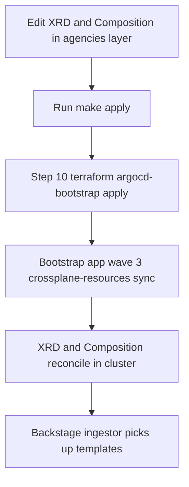

# XRD Authoring Guide (Crossplane + Backstage)

This guide defines how a new XRD should look in this repository so it works with:

1. Crossplane composition.
2. Backstage auto-ingestion via TeraSky kubernetes-ingestor.
3. Generic template slimming via `templatePostProcessor`.

## Goal Pattern

Use this pattern for new resources like `Customer`, `Agency`, etc:

1. One XRD with clear `spec` schema.
2. One Composition that maps `spec` fields to managed resources.
3. Cluster-scoped claim when possible (simpler UX).
4. Minimal required user input in XRD schema.
5. Provider-agnostic placement block (`spec.cluster`) instead of provider-specific top-level fields.

## Rollout Path (Current Ansible + Argo Flow)



## Required XRD Metadata

Use these annotations on the XRD:

```yaml
metadata:
  annotations:
    argocd.argoproj.io/sync-wave: "2"
    terasky.backstage.io/add-to-catalog: "true"
    terasky.backstage.io/owner: group:default/agencies-admins
    terasky.backstage.io/system: euroscale
    backstage.euroscale.io/scope: agencies-xrd
```

Notes:

1. `terasky.backstage.io/add-to-catalog: "true"` enables Backstage ingestion.
2. `backstage.euroscale.io/scope` is used by scoped permission policy.
3. Set owner/system to the Backstage refs you actually use.

## Naming Rule For Generic Template Slimming

The generic `templatePostProcessor` currently targets Crossplane templates where:

1. `metadata.labels.source == crossplane`
2. `spec.type` matches `^[a-z0-9.-]+\.euro\.scale$`

`spec.type` is generated from `xrd.metadata.name`, so your XRD name should end with `.euro.scale`.

Example:

1. `customers.euro.scale`
2. `agencystacks.euro.scale`

If you use a different naming convention, update rules in:

1. `tools/backstage-app/app-config.production.yaml`
2. `gitops/argocd/main/apps/infrastructure/backstage/helm-release.yaml`

## XRD Skeleton (Recommended)

```yaml
apiVersion: apiextensions.crossplane.io/v1
kind: CompositeResourceDefinition
metadata:
  name: customers.euro.scale
  annotations:
    argocd.argoproj.io/sync-wave: "2"
    terasky.backstage.io/add-to-catalog: "true"
    terasky.backstage.io/owner: group:default/agencies-admins
    terasky.backstage.io/system: euroscale
    backstage.euroscale.io/scope: agencies-xrd
spec:
  group: euro.scale
  scope: Cluster
  names:
    kind: Customer
    plural: customers
  claimNames:
    kind: CustomerClaim
    plural: customerclaims
  defaultCompositionRef:
    name: customer-kcp-workspace
  versions:
    - name: v1alpha1
      served: true
      referenceable: true
      schema:
        openAPIV3Schema:
          type: object
          properties:
            spec:
              type: object
              properties:
                customerName:
                  type: string
                  pattern: "^[a-z0-9]([-a-z0-9]*[a-z0-9])?$"
                  maxLength: 20
                cluster:
                  type: object
                  properties:
                    class:
                      type: string
                      enum: [external, eks, gke, aks, gardener-shoot, local-vcluster]
                    target:
                      type: object
                      properties:
                        argocdClusterName:
                          type: string
              required:
                - customerName
```

## Composition Skeleton (Recommended)

```yaml
apiVersion: apiextensions.crossplane.io/v1
kind: Composition
metadata:
  name: customer-kcp-workspace
  annotations:
    argocd.argoproj.io/sync-wave: "3"
spec:
  mode: Resources
  compositeTypeRef:
    apiVersion: euro.scale/v1alpha1
    kind: Customer
  resources:
    - name: kcp-workspace
      base:
        apiVersion: kubernetes.crossplane.io/v1alpha1
        kind: Object
        spec:
          forProvider:
            manifest:
              apiVersion: tenancy.kcp.io/v1alpha1
              kind: Workspace
              metadata:
                name: placeholder
              spec:
                type: universal
      patches:
        - type: FromCompositeFieldPath
          fromFieldPath: spec.customerName
          toFieldPath: spec.forProvider.manifest.metadata.name
```

## Where To Place Files

Canonical location used by the agencies layer app:

1. `../agencies/gitops/argocd/bootstrap/apps/base/crossplane/resources/`

Update `../agencies/gitops/argocd/bootstrap/kustomization.yaml` to include new files.

Optional legacy mirror:

1. `../agencies/gitops/argocd/bootstrap/apps/base/crossplane/compositions/`

Keep this in sync only if you still use that path in local tooling.

## Keep Backstage Forms Small

To keep the auto-generated template minimal:

1. Prefer `scope: Cluster` unless namespace is truly required.
2. Keep only business fields in `spec`.
3. Put platform defaults in Composition (not user inputs).
4. Use post-processor profiles/rules instead of custom per-XRD scaffolder code.
5. For multi-cluster support, prefer `spec.cluster.class` + `spec.cluster.target` as stable contract.

## Validation Checklist

Run before apply:

```bash
kubectl kustomize ../agencies/gitops/argocd/bootstrap >/tmp/agencies-crossplane.yaml
yarn workspace backend build --cwd tools/backstage-app
```

After deploy, verify:

1. XRD exists: `kubectl get xrd`
2. Backstage template is ingested (Create page).
3. Template shows only intended input fields.
