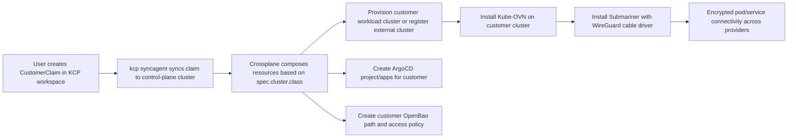

# Customer XRD and Cross-Cloud Cluster VPN (Kube-OVN + WireGuard)

## Goal

Define how a `Customer` is modeled as an XRD so each customer can run on different cluster types, and how two customer clusters can communicate securely across cloud providers using Kube-OVN with WireGuard.

## Target Architecture



## 1. Customer XRD Model (Provider-Agnostic)

Use one stable API and route provisioning by `spec.cluster.class`.

```yaml
apiVersion: apiextensions.crossplane.io/v1
kind: CompositeResourceDefinition
metadata:
  name: customerstacks.euro.scale
spec:
  group: euro.scale
  names:
    kind: CustomerStack
    plural: customerstacks
  claimNames:
    kind: CustomerStackClaim
    plural: customerstackclaims
  scope: Cluster
  versions:
    - name: v1alpha1
      served: true
      referenceable: true
      schema:
        openAPIV3Schema:
          type: object
          properties:
            spec:
              type: object
              properties:
                customerName:
                  type: string
                members:
                  type: array
                  items:
                    type: string
                    format: email
                cluster:
                  type: object
                  properties:
                    class:
                      type: string
                      enum:
                        - local-vcluster
                        - eks
                        - gke
                        - aks
                        - gardener-shoot
                        - external
                    region:
                      type: string
                    version:
                      type: string
                    target:
                      type: object
                      properties:
                        argocdClusterName:
                          type: string
                        namespace:
                          type: string
                network:
                  type: object
                  properties:
                    interconnect:
                      type: object
                      properties:
                        enabled:
                          type: boolean
                        mode:
                          type: string
                          enum: [submariner]
                        cableDriver:
                          type: string
                          enum: [wireguard, libreswan, vxlan]
                        globalnet:
                          type: boolean
              required:
                - customerName
                - cluster
```

### Recommended Composition Strategy

1. Use composition selection by class (`spec.cluster.class`) instead of one giant composition.
2. Keep one base composition for shared resources (Argo project, OpenBao path, Keycloak realm if needed).
3. Add class-specific compositions:
- `customerstack-local-vcluster`
- `customerstack-eks`
- `customerstack-gke`
- `customerstack-aks`
- `customerstack-gardener-shoot`
- `customerstack-external`
4. Keep cloud-provider specific parameters under `spec.cluster.provider` (free-form object).

## 2. How Provisioning Works

1. User submits `CustomerStackClaim` in KCP (customer workspace).
2. KCP `api-syncagent` publishes/syncs claim to the control-plane service cluster.
3. Crossplane reconciles claim and:
- creates or registers the target workload cluster,
- creates ArgoCD AppProject and bootstrap Applications for that customer,
- creates customer OpenBao path and policy,
- optionally creates network interconnect resources when `spec.network.interconnect.enabled=true`.
4. ArgoCD shows provisioning progress in the customer project.

## 3. Kube-OVN + WireGuard Across Cloud Providers

For Kube-OVN multi-cluster connectivity, use Submariner with `--cable-driver wireguard`.

### Why this path

1. Kube-OVN officially documents Submariner integration for cluster interconnection.
2. Submariner supports WireGuard cable driver.
3. Submariner handles NAT traversal patterns needed for cross-cloud connectivity.

### Prerequisites

1. Install Kube-OVN on both clusters.
2. Ensure Service CIDRs and default subnet CIDRs do not overlap, or enable Submariner Globalnet.
3. For Kube-OVN, set `submariner-global` ConfigMap with `use-nftables=false` before Submariner install.
4. Install WireGuard on candidate gateway nodes.
5. Open required UDP dataplane/NAT-T ports between gateway nodes (default UDP 4500, configurable).
6. In multi-node Kube-OVN clusters, ensure `ovn-default` gateway mode is `centralized` and gateway node selection matches Submariner gateway nodes.

### Baseline Setup Steps

1. Pick one cluster as Submariner broker.
2. Deploy broker:

```bash
subctl deploy-broker
```

3. Join each cluster with WireGuard driver:

```bash
subctl join broker-info.subm \
  --clusterid customer-a \
  --clustercidr <podCIDR-or-joinCIDRs> \
  --servicecidr <serviceCIDR> \
  --cable-driver wireguard

subctl join broker-info.subm \
  --clusterid customer-b \
  --clustercidr <podCIDR-or-joinCIDRs> \
  --servicecidr <serviceCIDR> \
  --cable-driver wireguard
```

4. Label gateway nodes:

```bash
kubectl label node <gateway-node> submariner.io/gateway=true
```

5. Verify:

```bash
subctl show all
subctl diagnose all
subctl verify --only connectivity
```

### If CIDRs overlap

Enable Globalnet on broker, then join clusters with per-cluster Globalnet CIDRs.

```bash
subctl deploy-broker --globalnet
subctl join broker-info.subm --clusterid customer-a --cable-driver wireguard --globalnet-cidr 242.1.0.0/16
subctl join broker-info.subm --clusterid customer-b --cable-driver wireguard --globalnet-cidr 242.2.0.0/16
```

## 4. What Must Be Added In Euroscale

1. New `customer` layer repo/folder (separate from control-plane and agencies).
2. Customer XRD and compositions (class-based, provider-agnostic).
3. Crossplane providers for target cluster types (AWS/GCP/Azure/Gardener/external registration path).
4. KCP API export/publish for customer claims so users create customers in KCP.
5. ArgoCD templates that create one customer project and show provisioning progress.
6. Optional network module that installs/joins Submariner when interconnect is requested.

## 5. Operational and Security Notes

1. Prefer cloud-native load balancers / public endpoints only for designated gateway nodes.
2. Keep WireGuard keys managed by Submariner; avoid manual static key handling.
3. Track MTU and fragmentation when crossing internet paths.
4. Add conformance checks in CI:
- expected Submariner CRs and gateway pods,
- successful `subctl diagnose all`,
- cross-cluster pod/service reachability.
5. Store no cleartext credentials in Kubernetes; continue using OpenBao + ExternalSecrets.

## 6. References

1. Kube-OVN Submariner integration: https://kubeovn.github.io/docs/stable/en/advance/with-submariner/
2. Submariner `subctl` join flags (`--cable-driver wireguard`): https://submariner.io/operations/deployment/subctl/
3. Submariner Gateway Engine (WireGuard driver support): https://submariner.io/getting-started/architecture/gateway-engine/
4. Submariner NAT traversal and UDP dataplane notes: https://submariner.io/operations/nat-traversal/
5. Submariner Globalnet for overlapping CIDRs: https://submariner.io/getting-started/architecture/globalnet/

## Notes for your requested Kube-OVN version

This guide uses the Kube-OVN Submariner integration pattern documented in Kube-OVN official docs. For `v1.16.x`, validate command examples against your exact `subctl` version at deployment time because flags and defaults can change between Submariner releases.

## 7. Implemented Baseline In This Repository

The current implementation now wires this baseline flow:

1. `CustomerStack`/`CustomerStackClaim` XRD + composition in `customer/gitops/argocd/bootstrap`.
2. `customer-layer` Argo bootstrap app from control-plane (`control-plane/gitops/argocd/bootstrap/customer-layer.yaml`).
3. KCP syncagent publishes both `AgencyStackClaim` and `CustomerStackClaim`.
4. Customer claim reconciliation creates an Argo app in the agency project (`project = spec.agencyName`).
5. Customer bootstrap app provisions:
- customer vCluster,
- tenant Crossplane installation into that vCluster,
- dedicated customer Backstage,
- dedicated oauth2-proxy,
- dedicated TLS cert + Istio gateway + virtualservice at `https://<customer>.<agency>.euroscale.local`.

Agency Backstage can auto-discover the customer claim template via Kubernetes ingestor and create customer claims with agency scoping.
